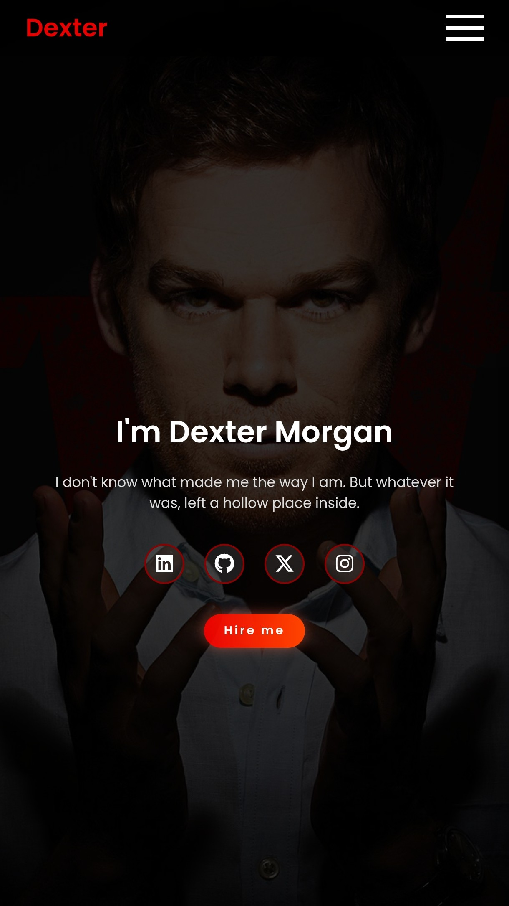

# Dexter Portfolio

 

Portfólio inspirado no personagem Dexter, com design moderno e efeitos especiais. Desenvolvido com HTML, CSS e JavaScript puro.

## ✨ Recursos

- Design responsivo (mobile, tablet, desktop)
- Menu mobile com animação
- Efeito de troca de personalidades (JavaScript)
- Transições suaves e microinterações
- Modo escuro padrão com toques de vermelho


## 🎨 Personalização

Altere estas variáveis no CSS para mudar o tema:
```css
:root {
  --red-accent: rgba(255, 0, 0, 0.9); /* Cor principal */
  --dark-red: #8B0000; /* Vermelho escuro */
  --text-light: #dddddd; /* Cor do texto */
}
```

## 📱 Responsividade

O layout se adapta a:
- Telas grandes (> 992px)
- Tablets (768px)
- Smartphones (< 480px)

## 📄 Licença

Este projeto está licenciado sob a licença MIT - veja o arquivo [LICENSE](LICENSE) para detalhes.

---

Desenvolvido com ❤️ por [EllieDevZone](https://github.com/elliedevzone)
